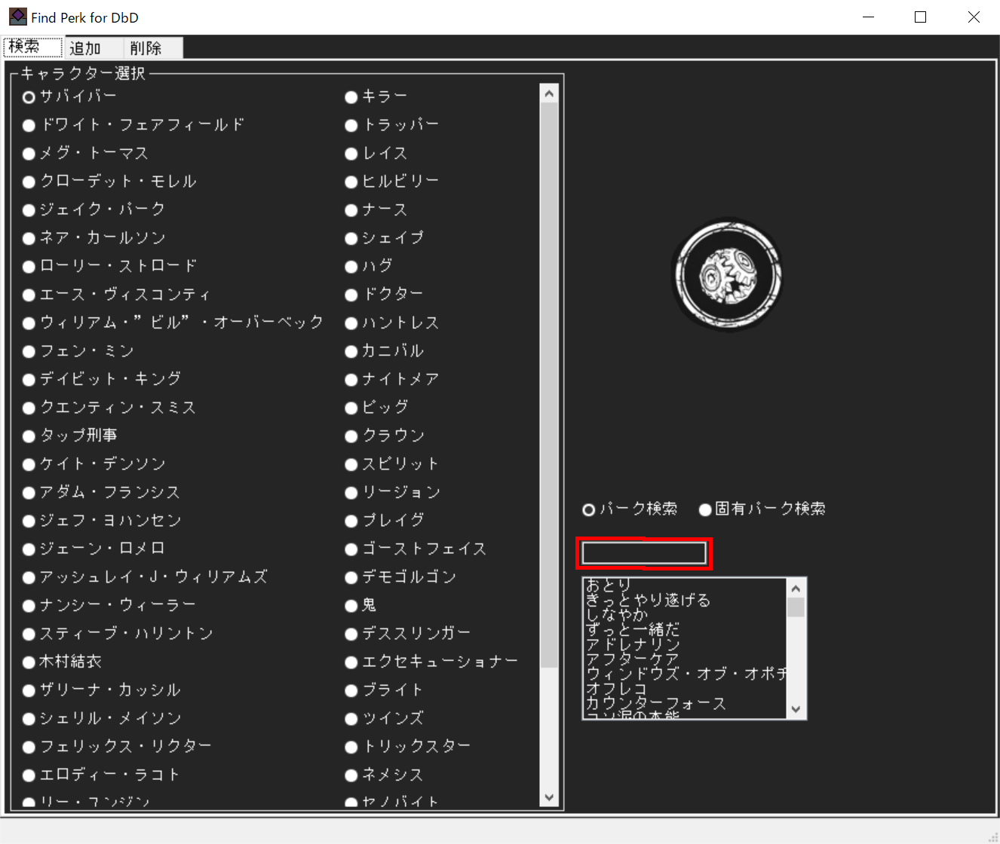
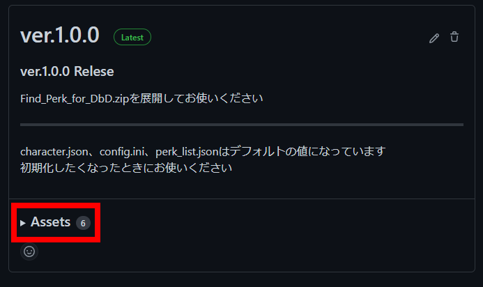

# Find Perk for DbD

パークの位置を検索するアプリです  
対応OS : Windows

ビルドし直せば他のOSでも動くと思います

左上のタブから`検索`、`追加`、`削除`タブを切り替えることができます

## キャラクターについて

左半分でキャラクター選択をします  
`サバイバー`と`キラー`はデフォルトでそれぞれすべてのパークを所持しています  
そのほかのキャラクターについてはデフォルトではなにも所持していません、あなたの取得状況に合わせて追加してください

## パーク名検索・固有パーク検索

画像で赤枠のところにパーク名またはキャラクター名を入力することで絞り込むことができます  
その下のリストボックスからパークを選択してください  

`パーク名検索` : パーク名から検索することができます  
`固有パーク検索` : キャラクター名または `共通`を入力することで入力したキャラクターの固有パークを検索できます


## 検索タブ

このタブでは、リストボックスからパークを選択するとリストボックスの下にパークの位置が表示されます

## 追加タブ

このタブでは、選択したキャラクターの所持パークにパークを追加することができます  
リストボックスからパークを選択し`追加`ボタンからパークを追加します  
shiftやcontrol+M1で複数選択できます

## 削除タブ

このタブでは、選択したキャラクターの所持パークからパークを削除することができます  
リストボックスからパークを選択し
`削除`ボタンで選択したパークを削除します  
`すべて削除`ボタンは選択したキャラクターからすべてのパークを削除します  
shiftやcontrol+M1で複数選択できます

## ダウンロード方法

[Releases](https://github.com/sisaku0439/Find_Perk_for_DbD/releases)ページに移動しAssetsから`Find_Perk_for_DbD.zip`ダウンロードしてください  


## オプション

'config.ini'ファイルにて色、アプリケーションサイズ設定を行えます  
半角で入力してください

- COLOR：RGB
- ratio : アプリケーションサイズの倍率

## 注意点

- パークは全てレベル3が前提です
- FHDの解像度に合わせて作っています
- `./character.json`を直接変更することでも追加/削除できます
- jsonファイル、iniファイルを変更する場合は`UTF-8`で編集してください

## ソースから実行する場合

- Python 3.9.10


```cmd
pip install wxPython==4.1.1
```

実行コマンド

```cmd
python main_window.py
```

## LICENSE

- 本アプリケーション : GNU General Public License v3.0
- wxPython : wxWindows Library License (https://opensource.org/licenses/wxwindows.php)

すべてのキャラクターの画像とすべてのパークの画像は`Official Dead by Daylight Wiki`([URL](https://deadbydaylight.fandom.com/wiki/Dead_by_Daylight_Wiki))がファイルのソースです
